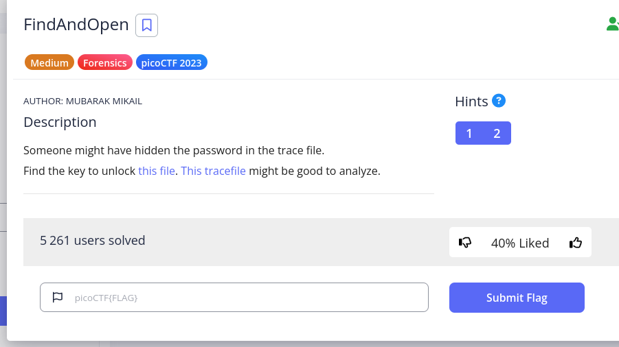
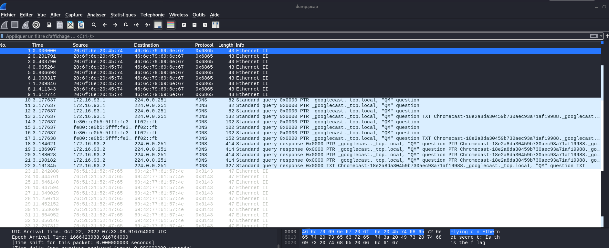
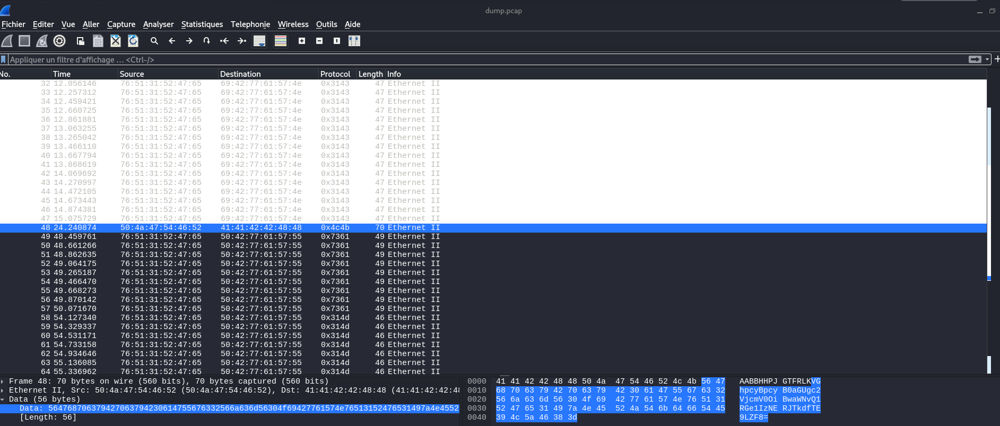

# findandopen

## Description

## Steps
There are two files to download. A .zip containing the flag and a .pcap, which contains the password to unlock the .zip

1. As there is a .pcap, I used Wireshark to analyze the packets.
This displays the following:

2. Scrolling a bit, I come across this packet. I see that there is a data value longer than the others. (The elements are highlighted in blue in the screenshot).

3. I decide to copy the Data value:
(right-click > copy > as a base64 String)
and decode it with this command:
`echo VGhpcyBpcyB0aGUgc2VjcmV0OiBwaWNvQ1RGe1IzNERJTkdfTE9LZF8= | base64 --decode`

4. which gives: `This is the secret: picoCTF{R34DING_LOKd_`

5. All that's left is to use it as a password to unlock the .zip that contains the flag