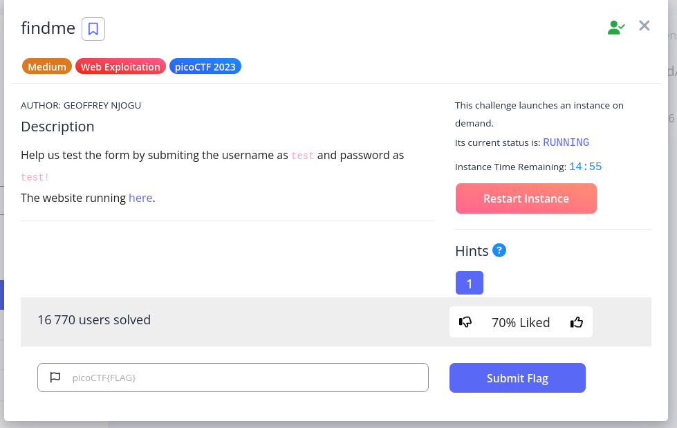
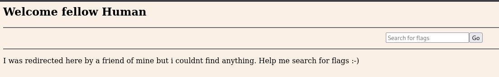

# findme

## Description

## Steps
The CTF ask to connect at a specific URL with a given username and password.

1. After login, the website welcome us with a message

2. So I went back on my browser history and saw 2 redirect with an URL with an `id` parameter.

3. I paste the value (which look like a lot of a base64 String) in the terminal like this : 

`echo cGljb0NURntwcm94aWVzX2FsbF90aGVfd2F5XzNkOWUzNjk3fQ== | base64 --decode`

4. The flag is printed.